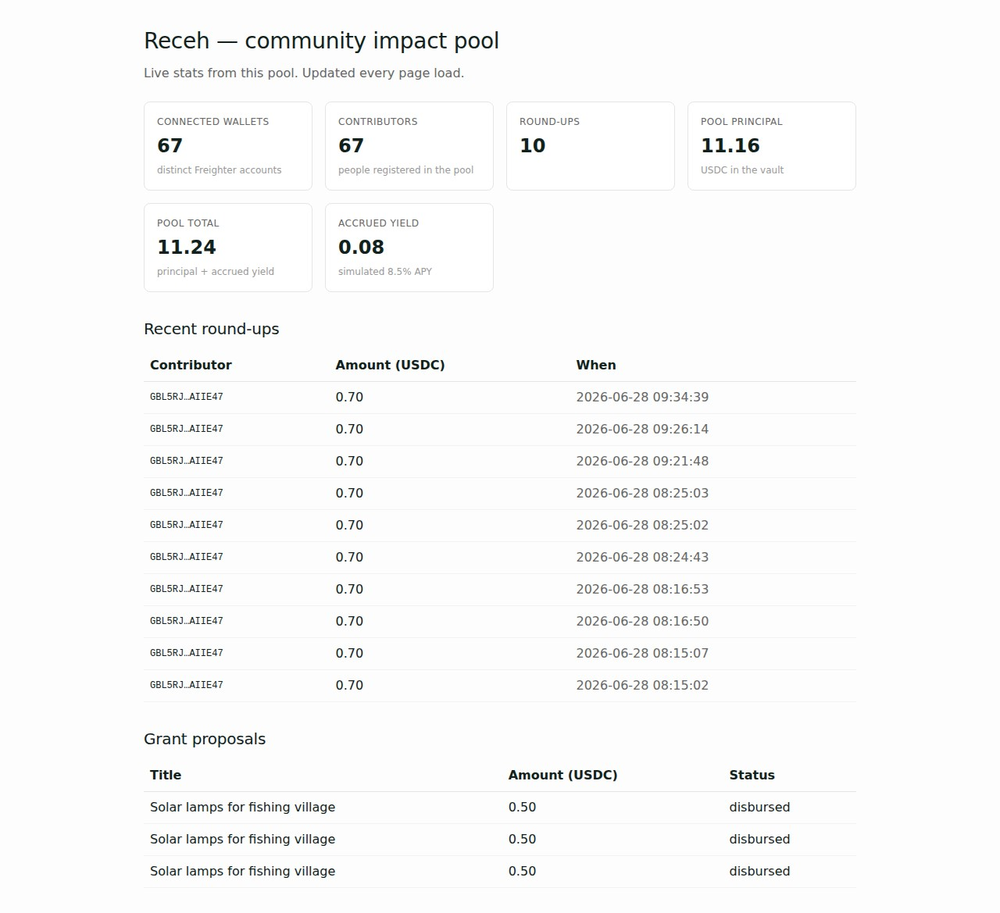

# Receh — Round-Ups That Fund Community Grants

A round-up yield pool on Stellar where spare change from real USDC purchases grows into community grants. Every cent is attributed on-chain via SEP-23 muxed addresses; every contributor decides where the grant goes.

LIVE on Stellar Testnet: https://receh-gamma.vercel.app

## What it is

Receh watches a shopper's purchase, rounds it up to the next whole USDC, and routes the spare change into a single shared yield pool on Stellar. Contributors sign each round-up with Freighter (SEP-10 + signMessage), and a SEP-7 URI sends the change to a per-contributor muxed vault address so attribution is provable on-chain. The pool accrues variable APY over its lifetime. Each month contributors vote on community grant proposals; the winning proposal is disbursed on-chain from the vault.

## How it works

1. **Connect** — Freighter requestAccess, server returns challenge nonce, Freighter signs, server sets session cookie.
2. **Register** — On first connect, the wallet address is registered as a contributor with a derived muxed (SEP-23) vault index.
3. **Round up** — Each purchase amount is rounded up; the difference becomes a SEP-7 payment URI addressed to the contributor's muxed destination.
4. **Sign & submit** — Freighter signs the SEP-7 payment; Horizon settles it; the receipt is recorded against the contributor's tally.
5. **Yield** — Pool principal accrues variable APY over the vault lifetime (Blend-market model).
6. **Propose & vote** — Contributors submit grant proposals; every contributor votes, weighted by their accumulated round-ups.
7. **Disburse** — Closing the voting window picks the winner and submits a real Stellar payment from the vault to the proposal payout address. The on-chain tx hash is shown with a stellar.expert link.

---
## Demo & Pitch Deck

- **Demo Video:** [Watch Demo]()
- **Pitch Deck:** [View Pitch Deck](https://drive.google.com/file/d/17qf44UnXSlH3l_SwYjo0Ej_3VjYa9vUf/view?usp=drive_link)
---

## Tech stack

Next.js 16 (App Router, Turbopack) · React 19 · TypeScript strict · Drizzle ORM on Postgres · `@stellar/stellar-sdk` · `@stellar/freighter-api` v6 · Tailwind v4 · Vitest · Playwright.

## Quick start

```bash
pnpm install
cp .env.example .env.local          # fill in DB + vault key + session secret
pnpm run db:push                    # apply Drizzle schema to Postgres
node scripts/init-vault.mjs         # seed the shared vault row (idempotent)
pnpm dev                            # http://localhost:3002

pnpm run build                      # production build
pnpm test                           # vitest unit + service tests
pnpm run test:e2e                   # Playwright (requires Freighter extension)
```

## Stellar integration

| Surface | Mechanism |
|---|---|
| Wallet auth | `requestAccess` → `signMessage(nonce)` → session cookie |
| Per-contributor attribution | `MuxedAccount(G_address, muxIndex)` — SEP-23 |
| Round-up routing | `web+stellar:pay?destination=…&amount=…&asset_code=USDC…` — SEP-7 |
| Yield pool ledger | `RecehPool` Soroban contract `CDNZX5D3WXVXMCBFZYCEB5SSRM5VHB2UZ55PKH55KSSOIJKCAACK6KUW` (initialize / record_roundup / create_grant / vote / disburse_grant) |
| Vault disbursement | Soroban `disburse_grant` invoke via `TransactionBuilder` + `rpc.Server.prepareTransaction` + vault keypair sign |
| Live receipts | Horizon `/payments?cursor=now` polled in `app/api/horizon-events` |

The shared vault account lives on Stellar Testnet at `GBL5RJKF4QNJ4ZPLJZ7PS7K5A4J44VEZJRV2CRTFFDRVSY2N76AIIE47`. The RecehPool Soroban contract is deployed at `CDNZX5D3WXVXMCBFZYCEB5SSRM5VHB2UZ55PKH55KSSOIJKCAACK6KUW` and any contract tx can be verified at `https://stellar.expert/explorer/testnet/tx/<txHash>`.

## Soroban contract

The RecehPool contract is a Rust crate at `contracts/receh-pool/`:

- `Cargo.toml` — `soroban-sdk = "22"`
- `src/lib.rs` — `RecehPool` contract with entry points `initialize`, `record_roundup`, `create_grant`, `vote`, `disburse_grant`, and views `get_total_pool`, `get_contribution`, `get_proposal`, `get_vote_count`, `get_disbursed`, etc.
- `src/test.rs` — 12 unit tests covering initialize, round-up, grant creation, weighted voting, strict-majority disbursement, double-vote / double-disburse guards, pause / unpause, and view helpers.
- `Makefile` — `make build`, `make test`, `make deploy`, `make init`.
- `scripts/deploy.sh` + `scripts/init.sh` — Stellar CLI deployment + initialize against the testnet.
- `DEPLOYMENT.md` — full deployment / wiring notes.

Build and test:

```bash
cd contracts/receh-pool
cargo test
cargo build --release --target wasm32-unknown-unknown
```

Wiring evidence (frontend to contract):

- `src/server/lib/recehPoolContract.ts` — wraps `new Contract(stellar.recehPoolContractId).call(...)` and exposes `buildDisburseXdr`, `buildVoteXdr`, `buildRecordRoundupXdr`, `submitSignedInvoke`, plus view helpers `readTotalPool`, `readAvailable`, `readMemberCount`, `readProposal`.
- `app/api/proposals/[id]/disburse/route.ts` — server-side flow: `TransactionBuilder` → `addOperation(contract.call('disburse_grant', u64ScVal(proposalId)))` → `stellar.soroban.prepareTransaction(tx)` → vault signs → `stellar.soroban.sendTransaction(tx)`.
- `app/api/contracts/disburse/route.ts` + `app/api/contracts/disburse/submit/route.ts` — split round-trip for client-side signing: backend prepares unsigned XDR, returns it, Freighter signs, backend submits.
- `app/api/contracts/stats/route.ts` and `app/api/contracts/proposals/[id]/route.ts` — read contract state straight from Soroban RPC for live verification.

Live deployment data: `contracts/.stellar/deploy.json` (contract id, WASM hash, upload / deploy / init tx hashes).

## Live stats

Counts pulled from `GET /api/stats` on the live deployment. Demo and test wallets are excluded so the numbers mean something — no inflated "users onboarded."



| Field | Value |
|---|---|
| Unique wallets | 67 |
| Logins | 67 |
| Contributors | 67 |
| Round-ups | 16 |
| Proposals | 3 |
| Votes | 3 |
| Grants disbursed | 3 |
| Pool total (USDC) | 11.24 |
| Accrued yield (USDC) | 0.0835 |

## Screenshots

Captured against the live Vercel deployment with real Freighter on testnet:

| Step | File |
|---|---|
| Landing | `../screen-shot/01-landing.jpg` |
| Connect grant popup | `../screen-shot/02-connect-popup.jpg` |
| Sign challenge popup | `../screen-shot/03-sign-challenge-popup.jpg` |
| Connected wallet chip | `../screen-shot/04-connected.jpg` |
| Core flow with vault + proposals | `../screen-shot/05-core-flow.jpg` |
| After vote (vote weight updated) | `../screen-shot/06-after-vote.jpg` |
| On-chain disbursement banner | `../screen-shot/07-disbursed-tx.jpg` |
| stellar.expert tx verification | `../screen-shot/08-stellar-expert.jpg` |
| Final stats | `../screen-shot/09-final-stats.jpg` |
| Mobile landing | `../screen-shot/10-mobile.jpg` |

## API endpoints

- `GET  /api/vault` — vault stats (principal, accrued yield, APY, contributors)
- `GET  /api/contributors` — list contributors ranked by total contributed
- `POST /api/contributors` — register a contributor (used after wallet connect)
- `GET  /api/contributors/by-pubkey/[address]` — lookup contributor by Stellar address
- `POST /api/roundups/quote` — preview a round-up + SEP-7 URI
- `POST /api/roundups` — record a confirmed round-up
- `GET  /api/proposals` — list grant proposals
- `POST /api/proposals` — submit a grant proposal
- `POST /api/proposals/[id]/vote` — cast a weighted vote
- `POST /api/proposals/[id]/disburse` — disburse an approved proposal on-chain
- `POST /api/vote-window/close` — close voting + auto-disburse the winner
- `GET  /api/horizon-events` — recent vault events (also supports `?stream=1` SSE)
- `GET  /api/stats` — public aggregate counts
- `POST /api/auth/challenge` — start a session: returns nonce
- `POST /api/auth/verify` — finish a session: stores cookie
- `GET  /api/auth/me` — current session info
- `DELETE /api/auth/me` — disconnect

## Environment

See `.env.example`. The deploy uses a Supabase Postgres URL plus the testnet vault keypair. The vault must hold at least a few XLM to cover disburse transactions.